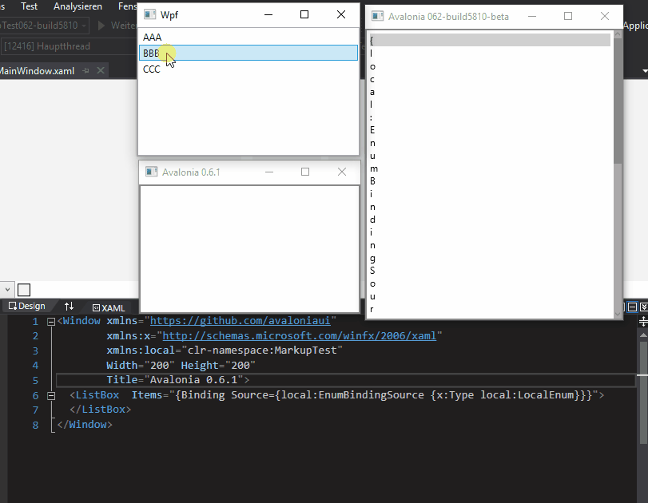

MarkupExtension not working 

This repo contains three projects with a sample MarkupExtension.
All projects are created as similar as possible and should show the fields of this enum in a ListBox...
`
   public enum LocalEnum
    {
        AAA,
        BBB,
        CCC
    }
`
...with this Binding...
`
{Binding Source={local:EnumBindingSource {x:Type local:LocalEnum}}}
`
...through the EnumBindingSourceExtension...

AvaloniaMarkupTest061
--> Shows nothing

AvaloniaMarkupTest062-build5810-beta
--> Shows the Binding string, expected Enum Values

WpfMarkupTest
--> WPF Version works as expected

